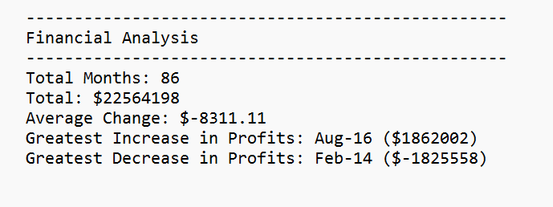
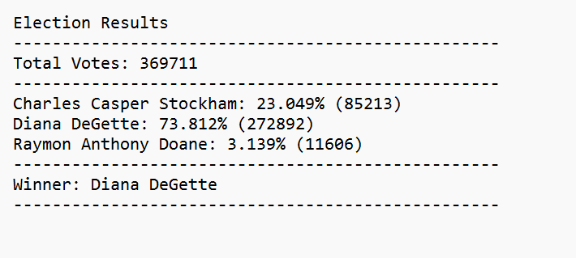

# Python Challenge

In this challenge we were provided with two different datasets:

# 1. PyBank 

The first one is called PyBank in which we were tasked with creating a Python script to analyze the financial records of our company. 
We were given a financial dataset called budget_data.csv, which is composed of two columns: "Date" and "Profit/Losses", and from this data we obtained:
1) The total number of months included in the dataset
2) The net total amount of "Profit/Losses" over the entire period
3) The changes in "Profit/Losses" over the entire period, and then the average of those changes
4) The greatest increase in profits (date and amount) over the entire period
5) The greatest decrease in profits (date and amount) over the entire period.

### PyBank Results:
<!--  -->

# 2. PyPoll

The second one is called PyPoll in which we were tasked with helping a small, rural town modernize its vote-counting process.
We were given a set of poll data called election_data.csv, which is composed of three columns: "Voter ID", "County", and "Candidate", and from this data, we analyzed the votes and calculated each of the following values:
1) The total number of votes cast
2) A complete list of candidates who received votes
3) The percentage of votes each candidate won
4) The total number of votes each candidate won
5) The winner of the election based on popular vote.

### PyPoll Results:
<!--  -->

### Note:
<u>PyPoll</u> has two scripts - (*"main.py"* and *"poll_script_2.py"*), both work perfectly. It is just that they have kind of different logic. 

